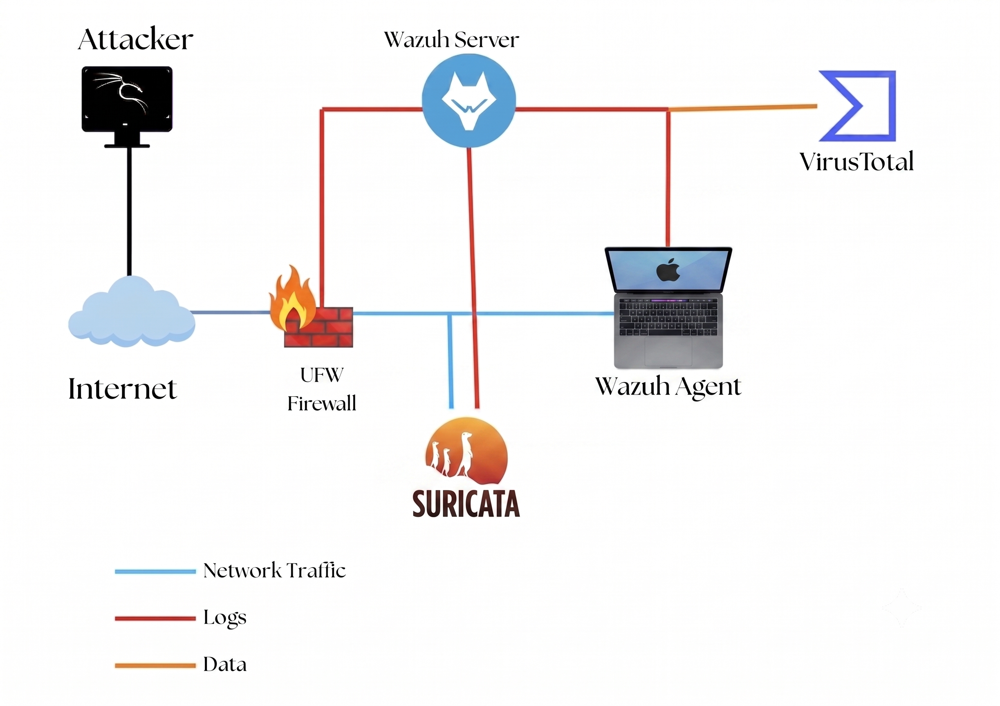

# Wazuh-SOC-Lab
Welcome to my Wazuh SOC Lab repository! This project documents my journey of deploying, configuring, and implementing different security tools.
# 📝 Overview
This project demonstrates the end-to-end deployment and configuration of different security tools using the open-source Wazuh SIEM/XDR platform.
# 🏗️ Lab Architecture
The Lab includes the following components:
| Category | Technology |
| :--- | :--- | 
| **Hardware** | Dell Latitude E5440 | 
| **OS** | Debian 13 (Headless) | 
| **Security** | UFW, OpenSSH | 
| **Containerization** | Docker | 
| **DNS Defense** | Pi-hole | 
| **Wazuh Server** | Runs the central Wazuh Manager, Indexer, and Dashboard. Collects and correlates logs from agents, Suricata, and UFW. |
| **Endpoint (Macbook Air)** | Runs the Wazuh Agent for system monitoring and log forwarding. |
| **UFW Firewall** | Provides firewall logs. Integrated into Wazuh for anomaly detection. |
| **Suricata IDS/IPS** | Monitors network traffic, Sends IDS alerts to Wazuh. |

*Figure 1: SOC Lab Architecture.*

# Wazuh Setup

[Wazuh Server setup PDF Guide](docs/wazuh-setup.pdf)

**Summary:**
- Deploy Wazuh in a docker container environment.
- Configure and troubleshoot Wazuh services, then access the Dashboard for monitoring.
- Install and register endpoint agents to collect logs and centralize security visibility.

# Wazuh Agent and Endpoint Setup

# Conclusion
This SOC home lab project successfully demonstrated how open-source tools can be combined to build a functional security monitoring and detection environment. By integrating **Wazuh** as the central SIEM, **UFW** as the firewall, **Suricata** as the IDS/IPS, and **Sysmon** for endpoint visibility, the lab replicated key components of a modern SOC. The addition of **VirusTotal** enrichment and **File Integrity Monitoring** further enhanced detection capabilities and contextual analysis.

Through the threat simulation exercise (brute-force attack detection), the lab validated that the system can not only ingest and correlate logs but also generate meaningful alerts. This reflects a realistic analyst workflow: detecting, investigating, and proposing defensive countermeasures.

Beyond technical skills, this project also reinforced critical SOC analyst practices: log analysis, alert triage, rule tuning, and threat hunting queries.
  
**Note:** This is for educational purposes only. Do not use these techniques for unauthorized activities.

📌 Connect with Me:  
[LinkedIn](https://www.linkedin.com/in/pranshuparashar/)
